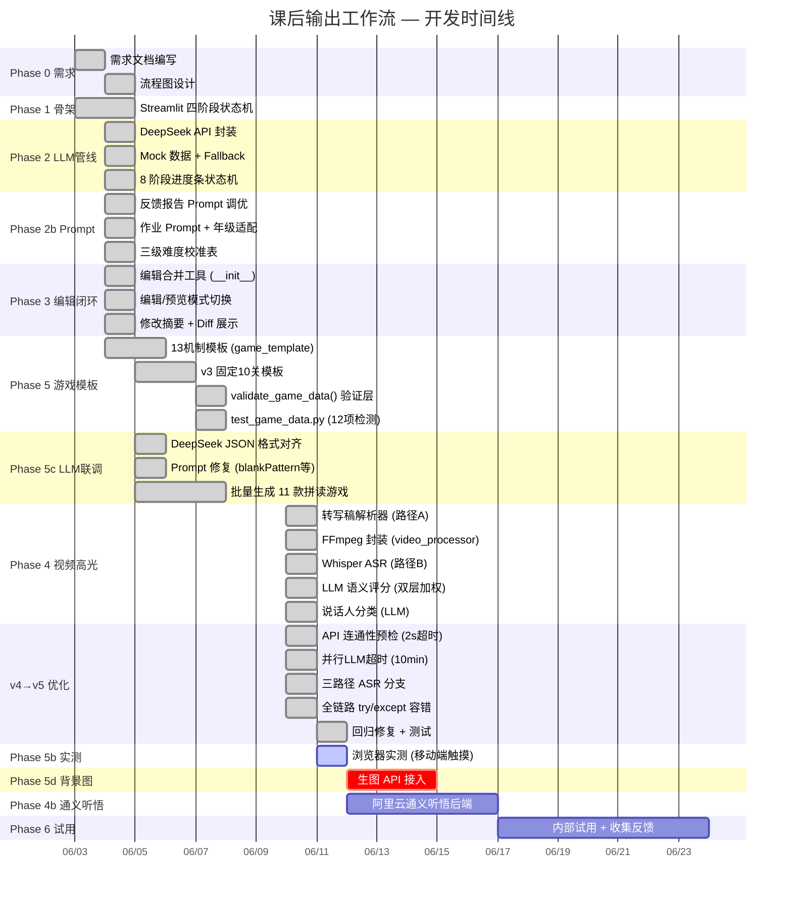

# 课后输出工作流 (Post-Class Workflow) — 完整开发甘特图

> **生成时间**: 2026-06-11  
> **数据来源**: `.claude/file-history/` 23 个 session、`.claude/jobs/` 16 个 job、项目文件时间戳、`post-class-workflow.md` 记忆文件  
> **Mermaid 甘特图**：在 GitHub / Notion / Obsidian / VS Code / Typora 中可直接渲染

---

## 🎯 项目概况

| 维度 | 数据 |
|------|------|
| 开发周期 | 2026-06-03 → 2026-06-11（8 天） |
| Claude 会话数 | 23 个 session，16 个 job |
| 代码文件 | 10 个 Python 文件 + 2 个 HTML 模板 |
| 累计编辑 | ~150 次文件写入 |
| 核心代码量 | app.py 84KB + utils/*.py 120KB + 模板 152KB |
| 当前阶段 | Phase 5b 浏览器实测（待完成） |
| 项目路径 | `C:\Users\23899\Projects\post-class-workflow/` |

---

## 📅 Mermaid 甘特图



---

## 🔢 版本演进

| 版本 | 日期 | Session ID | 关键产出 |
|------|------|-----------|---------|
| **v1** | 06-03→06-04 | `78f6c943` | app.py 骨架(30KB)、Phase 0-3 基础 |
| **v2** | 06-04 | `2ae6bdf1` | Prompt 优化、游戏模板 v1(72KB) |
| **v3** | 06-04→06-07 | `23477198`, `bd124b32` | 游戏模板 v3(76KB)、11款游戏输出(58MB) |
| **v4** | 06-07→06-10 上午 | `1957cca1` (named) | Phase 4 视频高光、三路径 ASR、test_game_data.py |
| **v5** | 06-10 下午 | `17ee5f71` (named) | API预检、并行超时、全链路容错、说话人分类降级 |

---

## 📊 文件演进热力图

```
文件                    06/03  06/04  06/05  06/06  06/07  06/10  06/11
─────────────────────────────────────────────────────────────────────
app.py                   ████   ████                 ██    █████  █
prompts.py               ██     ████                        ███
llm_client.py            █      ███                        ████   █
mock_data.py                    ██                         ██
game_template.html              █████  ██
game_template_v3.html                  ██    ██    ███
game_renderer.py                             ███
test_game_data.py                             ██
transcript_parser.py                                  ███
video_processor.py                                    ██
asr_client.py                                         ███
__init__.py                    ██
需求文档.md              ██
```

---

## 🗂️ 文件清单与职责

| 文件 | 大小 | 职责 | 首次创建 |
|------|------|------|---------|
| `app.py` | 84KB | Streamlit UI 4阶段状态机 + 24微阶段处理管线 | 06-03 |
| `utils/prompts.py` | 26KB | Feedback/Homework/Highlight/SpeakerClassify 四大 Prompt | 06-03 |
| `utils/llm_client.py` | 15KB | DeepSeek API + LLM语义评分 + 说话人分类 + 降级保护 | 06-03 |
| `utils/mock_data.py` | 27KB | Mock 数据（反馈/作业/腾讯会议转写稿） | 06-04 |
| `utils/game_renderer.py` | 9KB | 游戏 HTML 渲染引擎 + validate_game_data() 验证层 | 06-07 |
| `utils/game_template.html` | 79KB | 旧版 13 机制灵活模板（已废弃） | 06-04 |
| `utils/game_template_v3.html` | 76KB | v3 固定 10 关模板（当前使用） | 06-07 |
| `utils/transcript_parser.py` | 20KB | 腾讯会议转写稿解析（4种格式） | 06-10 |
| `utils/video_processor.py` | 13KB | FFmpeg 封装（提取/裁剪/合并） | 06-10 |
| `utils/asr_client.py` | 15KB | Whisper ASR + LLM 说话人分类 | 06-10 |
| `utils/__init__.py` | 4KB | merge_feedback_edits() + get_edit_diff() | 06-04 |
| `utils/session.py` | 2KB | Session JSON 持久化 | 06-03 |
| `test_game_data.py` | 7KB | 12 项自动检测（数据验证+HTML分析） | 06-07 |

---

## 🔑 关键架构决策时间线

| 日期 | 决策 | 影响 |
|------|------|------|
| 06-03 | 四阶段状态机 (submit→processing→review→published) | 全局架构 |
| 06-03 | 三层分离 (prompts / llm_client / app.py) | 可维护性 |
| 06-04 | Fallback 机制 (API失败→Mock降级) | 稳定性 |
| 06-04 | 放弃 LLM 直出 HTML → 纯模板渲染 | Phase 5 方向 |
| 06-07 | 13机制灵活→10关固定骨架 (v3) | LLM 理解成本↓ |
| 06-07 | 14个 Bug baked-in (english-game v2 实战验证) | 模板质量 |
| 06-10 | 双路径 ASR (A:转写稿解析 / B:Whisper) | Phase 4 灵活性 |
| 06-10 | 40%规则+60%LLM 双层高光评分 | 准确性 |
| 06-10 | 全链路 try/except + API 预检 | v5 稳健性 |

---

## 🐛 已修复 Bug 清单

| # | 发现日期 | 描述 | 修复日期 |
|---|---------|------|---------|
| 1 | 06-04 | 进度条在 LLM 阶段卡住（Streamlit 单线程） | 06-04 |
| 2 | 06-04 | has_praise 检查学生文本而非教师反馈 | 06-04 |
| 3 | 06-04 | `_proc_stage` vs `_proc_step` 命名不一致 | 06-04 |
| 4 | 06-04 | autocomplete 浏览器警告 | 06-04 |
| 5 | 06-07 | 流星捕手缺少保底计数器 | 06-07 |
| 6 | 06-07 | 捕梦网字母值匹配缺失 | 06-07 |
| 7 | 06-07 | 星座字母值扫描缺失 | 06-07 |
| 8 | 06-07 | 连线配对(connectMatch)点击无反应 | 06-07 |
| 9 | 06-07 | blankPattern id 从1开始(应0) | 06-07 |
| 10 | 06-07 | 答案重复未去重 | 06-07 |
| 11 | 06-10 | LLM 语义评分缺少 try/except（v5 回归） | 06-11 |
| 12 | 06-10 | 说话人分类失败丢 Whisper 结果 | 06-10 |
| 13 | 06-07 | 捕梦网轨道半径过大 | 06-07 |

---

## 📈 代码量增长曲线

```
84KB ─                                              ● ─ app.py
     │                                          ▄▄▄▄█
70KB ─                                  ▄▄▄▄▄▄▄▄
     │                          ▄▄▄▄▄▄▄▄
56KB ─                  ▄▄▄▄▄▄▄▄
     │          ▄▄▄▄▄▄▄▄
42KB ─  ▄▄▄▄▄▄▄▄
     │
28KB ─                              ● ─ mock_data.py
     │          ▄▄▄▄▄▄▄▄▄▄▄▄▄▄▄▄▄▄
14KB ─  ● ─ llm_client.py
     │  ▄▄▄▄▄▄▄▄▄▄▄▄▄▄▄▄▄▄▄▄▄▄▄▄
     │  ▄▄ prompts.py
 0KB ───┼─────┼─────┼─────┼─────┼─────┼──
      06/03 06/04 06/05 06/06 06/07 06/10 06/11
```

---

## 🚧 待完成

| 优先级 | 任务 | Phase | 预估 |
|--------|------|-------|------|
| 🔴 P0 | 移动端触摸测试（L7流星/L9捕梦网/L10刮刮卡） | 5b | 1d |
| 🔴 P0 | Confetti 验收（4轮 staggered） | 5b | 0.5d |
| 🟡 P1 | 背景图生图 API 接入 | 5d | 3d |
| 🟡 P1 | 通义听悟后端（中英混合+说话人分离） | 4b | 5d |
| 🟢 P2 | 日志面板微阶段进度映射调优 | UX | 1d |
| 🟢 P2 | 内部试用 + 收集反馈 | 6 | 7d |

---

## 🤖 AI 模型生成甘特图 Prompt

> 将以下内容复制到支持图表生成的 AI 工具（如 Claude、ChatGPT、Gemini）中：

```
请根据以下课后输出工作流（Post-Class Workflow）项目的完整开发时间线，
生成一张可交互的甘特图（Gantt Chart），输出为独立的 HTML 文件。

## 项目信息
- 名称：课后输出工作流（Post-Class Workflow）
- 技术栈：Streamlit + DeepSeek API + Whisper + FFmpeg
- 代码量：app.py 84KB + 10个工具文件 120KB

## 开发时间线（精确到日期）

| 日期范围 | Phase | 任务 | 状态 | 产出 |
|----------|-------|------|------|------|
| 6/3 | P0 | 需求文档+流程图 | ✅ | 需求文档.md |
| 6/3-6/4 | P1 | Streamlit 四阶段状态机骨架 | ✅ | app.py v1 |
| 6/4 | P2 | DeepSeek API 封装+Mock Fallback | ✅ | llm_client.py, mock_data.py |
| 6/4 | P2b | Prompt 优化（反馈+作业+年级适配） | ✅ | prompts.py v1 |
| 6/4 | P3 | 反馈报告编辑闭环（merge/diff） | ✅ | __init__.py |
| 6/4-6/5 | P5 | 游戏HTML模板引擎（13机制→v3） | ✅ | game_template_v3.html |
| 6/5-6/7 | P5c | LLM联调+批量生成11款游戏 | ✅ | output/*.html (58MB) |
| 6/7 | P5 | validate_game_data() + 12项检测 | ✅ | test_game_data.py |
| 6/10 | P4 | 转写稿解析器（4格式自动检测） | ✅ | transcript_parser.py |
| 6/10 | P4 | FFmpeg封装+Whisper ASR | ✅ | video_processor.py, asr_client.py |
| 6/10 | P4 | LLM语义评分（40%规则+60%LLM） | ✅ | llm_client.py v4 |
| 6/10 | v5 | API预检+并行超时+全链路容错 | ✅ | app.py v5 |
| 6/11 | v5 | 回归修复+测试验证(12/12通过) | ✅ | llm_client.py fix |
| 6/11→ | P5b | 移动端触摸测试+Confetti验收 | 🟡 | 待完成 |
| TBD | P5d | 背景图生图API（DALL-E/SD） | ⬜ | 计划中 |
| TBD | P4b | 通义听悟后端接入 | ⬜ | 计划中 |
| TBD | P6 | 内部试用+收集反馈 | ⬜ | 计划中 |

## 版本里程碑
- v1 (6/3-6/4): 基础架构（78f6c943）
- v2 (6/4): Prompt+模板v1（2ae6bdf1）
- v3 (6/4-6/7): 模板v3+批量生成（23477198, bd124b32）
- v4 (6/7-6/10): 视频高光+ASR（1957cca1 "post-class v4"）
- v5 (6/10-6/11): 稳健性优化（17ee5f71 "post-class v5"）

## 技术要求
- 输出为单个 HTML 文件，使用纯 CSS/JS（推荐 Frappe Gantt 或 vis-timeline）
- 支持鼠标悬停显示任务详情
- 已完成任务绿色，进行中黄色，计划中灰色
- 包含代码量增长子图（app.py 从 30KB→84KB）
- 包含 Bug 修复时间线子图（13个 bug 的发现/修复日期）
- 移动端响应式
- 中英文双语标签

## 额外数据
- 23 个 Claude 会话，150+ 次编辑
- 11 款拼读游戏产出（4-8MB each，含 base64 背景图）
- 13 个已修复 Bug（详见记忆文件）
- 当前总代码量：~400KB（Python + HTML 模板 + 游戏输出）
```

---

## 📎 相关文档

- 需求文档：`C:\Users\23899\Desktop\课后输出工作流-需求文档.md`
- 项目记忆：`C:\Users\23899\.claude\projects\C--Users-23899\memory\post-class-workflow.md`
- 设计规范：`C:\Users\23899\.claude\projects\C--Users-23899\memory\edu-game-design-patterns.md`
- 11 款游戏输出：`output/` 目录
- 测试截图：`screenshots/` 目录
- Gantt 源文件：本文件
